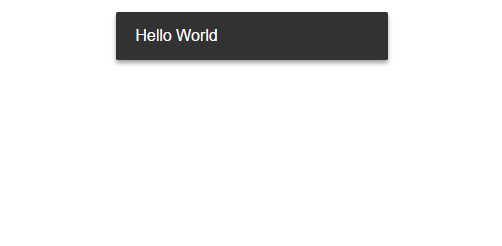

# siiimple-toast

> Toast message inspired by material design

[](https://badge.fury.io/js/siiimple-toast)
[]()
[]()



**siiimple-toast** is a **Pure** Javascript library for non-blocking notifications.

## Demo

[https://eunseok.me/siiimple-toast/](https://eunseok.me/siiimple-toast/)

## Installation

### npm
```
$ yarn add siiimple-toast
```

### cdn
```html
<!-- import css -->
<link href="https://cdn.jsdelivr.net/npm/siiimple-toast/dist/style.css" rel="stylesheet">
<!-- import js -->
<script src="https://cdn.jsdelivr.net/npm/siiimple-toast/dist/siiimple-toast.min.js"></script>
```

## Getting started

### npm

```javascript
import toast from 'siiimple-toast';
import 'siiimple-toast/dist/style.css';// style required

toast.message('Hello world');
```

### cdn
```html
<script>
  siiimpleToast.message('Hello world');
  // window.siiimpleToast === siiimpleToast
</script>
```

 if you want to customize style, see [style.css](./dist/style.css) or [style.scss](./src/style.scss)

### Onther examples

```javascript
// success message
toast.success('Successfully processed');

// alert message
toast.alert('Something seems to be wrong');

// support HTML
toast.message('<button>Support HTML</button>'); 

// message with options
toast.message('Set options', { delay: 1000 });

// support chaining
toast
  .message('support')
  .success('chaining', { delay: 1000 });

```

## Options

Use `.setOptions()` to set options

```javascript
toast = toast.setOptions({
  container: 'body',
  class: 'siiimpleToast',
  position: 'top|center',
  margin: 15,
  delay: 0,
  duration: 3000,
  style: {},
});
```
- `container` (`string`): selector for parent of toast elements (defaults to `body`)
  - use `position: relative`, `overflow: hidden` to prevent overflow
- `class` (`string`): css class for toast element (defaults to `siiimpleToast`)
- `position` (`string`): positioning toast element (defaults to `top|center`)
  - available: `top|left`, `top|center`, `top|right`, `bottom|left`, `bottom|center`, `bottom|right`
- `margin` (`number`): margin between multiple toast (defaults to `15px`)
- `delay` (`number`): delay before showing toast element (defaults to `0ms`)
- `duration` (`number`): duration to show toast element (defaults to `3000ms`)
- `style` (`object`): styles for customize tosat element (defaults to `{}`)

## Available

IE9+, Chrome, Opera

## License

This project is licensed under the MIT License